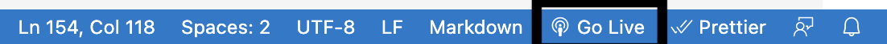

<!-- Improved compatibility of back to top link: See: https://github.com/othneildrew/Best-README-Template/pull/73 -->

<a name="readme-top"></a>


To do

developer

1. npm run dev
2. what each module means
3. pr review guidelines

User

1. how to start the app
2. what each button means: what a record means, what an account means

<!--
*** Thanks for checking out the Best-README-Template. If you have a suggestion
*** that would make this better, please fork the repo and create a pull request
*** or simply open an issue with the tag "enhancement".
*** Don't forget to give the project a star!
*** Thanks again! Now go create something AMAZING! :D
-->

<!-- PROJECT SHIELDS -->
<!--
*** I'm using markdown "reference style" links for readability.
*** Reference links are enclosed in brackets [ ] instead of parentheses ( ).
*** See the bottom of this document for the declaration of the reference variables
*** for contributors-url, forks-url, etc. This is an optional, concise syntax you may use.
*** https://www.markdownguide.org/basic-syntax/#reference-style-links
-->
<!-- 
[![Contributors][contributors-shield]][contributors-url]
[![Forks][forks-shield]][forks-url]
[![Stargazers][stars-shield]][stars-url]
[![Issues][issues-shield]][issues-url]
[![MIT License][license-shield]][license-url]
[![LinkedIn][linkedin-shield]][linkedin-url] -->

<!-- PROJECT LOGO -->
<!-- <br />
<div align="center">
  <a href="https://github.com/save-thinking/group-1-save-thinking">
    
  </a> -->

<h3 align="center">CSE210 Save/Thinking</h3>

  <p align="center">
    <!-- project_description -->
    <!-- <br />
    <a href="https://github.com/save-thinking/group-1-save-thinking"><strong>Explore the docs »</strong></a>
    <br />
    <br />
    <a href="https://github.com/save-thinking/group-1-save-thinking">View Demo</a>
    ·
    <a href="https://github.com/save-thinking/group-1-save-thinking/issues">Report Bug</a>
    ·
    <a href="https://github.com/save-thinking/group-1-save-thinking/issues">Request Feature</a> -->
  </p>
</div>

<!-- TABLE OF CONTENTS -->
<details>
  <summary>Table of Contents</summary>
  <ol>
    <li>
      <a href="#about-the-project">About The Project</a>
      <ul>
        <li><a href="#built-with">Built With</a></li>
      </ul>
    </li>
    <li>
      <a href="#getting-started">Getting Started</a>
      <ul>
        <!-- <li><a href="#prerequisites">Prerequisites</a></li> -->
        <li><a href="#installation">Installation</a></li>
      </ul>
    </li>
    <li><a href="#usage">Usage</a></li>
    <!-- <li><a href="#roadmap">Roadmap</a></li> -->
    <li><a href="#contributing">Contributing</a></li>
    <li><a href="#license">License</a></li>
    <li><a href="#contact">Contact</a></li>
    <li><a href="#acknowledgments">Acknowledgments</a></li>
  </ol>
</details>

<!-- ABOUT THE PROJECT -->

<!-- ## About The Project -->

<!-- [![Product Name Screen Shot][product-screenshot]](https://example.com) -->

<!-- Here's a blank template to get started: To avoid retyping too much info. Do a search and replace with your text editor for the following: `github_username`, `repo_name`, `twitter_handle`, `linkedin_username`, `email_client`, `email`, `project_title`, `project_description` -->

<!-- <p align="right">(<a href="#readme-top">back to top</a>)</p> -->

<!-- ### Built With

- [![Next][next.js]][next-url]
- [![React][react.js]][react-url]
- [![Vue][vue.js]][vue-url]
- [![Angular][angular.io]][angular-url]
- [![Svelte][svelte.dev]][svelte-url]
- [![Laravel][laravel.com]][laravel-url]
- [![Bootstrap][bootstrap.com]][bootstrap-url]
- [![JQuery][jquery.com]][jquery-url]

<p align="right">(<a href="#readme-top">back to top</a>)</p> -->

<!-- GETTING STARTED -->

## Getting Started

<!-- ### Prerequisites

This is an example of how to list things you need to use the software and how to install them.

- npm
  ```sh
  npm install npm@latest -g
  ``` -->

### Installation

This is how you may set up this project locally. To get a local copy up and running follow these simple steps.

0. Install VSCode: this step helps with setting up a live server easily
1. Clone the repo
   ```sh
   git clone https://github.com/save-thinking/group-1-save-thinking.git 
   ```
2. Install NPM packages
   ```sh
   npm install
   ```
3. To run the test suite:
   ```sh
   npm test
   ```

### Running the Application

To run the dashboard.html/record.html file: 

1. Install the live server extension on VSCode, details
    a. name: Live Server
    b. version: v5.7.9
    c. author: Ritwick Dey
2. Click and open the dashboard.html/record.html file on VSCode. Click on the Go Live button on the bottom tool bar. 




### Developer's Guide (can be moved to a new HowTo.md file)

Starting work on the project:

1. Clone the repo
   ```sh
   git clone https://github.com/save-thinking/group-1-save-thinking.git 
   ```
2. Install NPM packages
   ```sh
   npm install
   ```
Before every push do the following:

1. To fix all the code formatting on your end:
   ```sh
   npm run fix
   ```
2. To check lint issues:
   ```sh
   npm run lint
   ```
3. To run the test suite and check code coverage:
   ```sh
   npm test
   ```

Format for GitHub pushes and pull requests:

1. Never push to main
2. Create a new branch called 
  a. Feature/name_of_feature
  b. Bug/name_of_bug
3. Push changes to your branch
4. Create a new Pull request:
  a. Ensure that all changes made are listed 
  b. Add screenshots showing that the new changes work


After every push:

1. Check the build workflow in the actions tab in GitHub
2. Check if there are any linter issues
3. Check if all tests have passed

<p align="right">(<a href="#readme-top">back to top</a>)</p>

<!-- USAGE EXAMPLES -->

<!-- ## Usage

Use this space to show useful examples of how a project can be used. Additional screenshots, code examples and demos work well in this space. You may also link to more resources.

_For more examples, please refer to the [Documentation](https://example.com)_

<p align="right">(<a href="#readme-top">back to top</a>)</p> -->

<!-- ROADMAP -->

<!-- ## Roadmap

- [ ] Feature 1
- [ ] Feature 2
- [ ] Feature 3
  - [ ] Nested Feature

See the [open issues](https://github.com/save-thinking/group-1-save-thinking/issues) for a full list of proposed features (and known issues).

<p align="right">(<a href="#readme-top">back to top</a>)</p> -->

<!-- CONTRIBUTING -->

<!-- ## Contributing

Contributions are what make the open source community such an amazing place to learn, inspire, and create. Any contributions you make are **greatly appreciated**.

If you have a suggestion that would make this better, please fork the repo and create a pull request. You can also simply open an issue with the tag "enhancement".
Don't forget to give the project a star! Thanks again!

1. Fork the Project
2. Create your Feature Branch (`git checkout -b feature/AmazingFeature`)
3. Commit your Changes (`git commit -m 'Add some AmazingFeature'`)
4. Push to the Branch (`git push origin feature/AmazingFeature`)
5. Open a Pull Request

<p align="right">(<a href="#readme-top">back to top</a>)</p> -->

<!-- LICENSE -->

<!-- ## License

Distributed under the MIT License. See `LICENSE.txt` for more information.

<p align="right">(<a href="#readme-top">back to top</a>)</p> -->

<!-- CONTACT -->

<!-- ## Contact

Your Name - [@twitter_handle](https://twitter.com/twitter_handle) - email@email_client.com

Project Link: [https://github.com/save-thinking/group-1-save-thinking](https://github.com/save-thinking/group-1-save-thinking)

<p align="right">(<a href="#readme-top">back to top</a>)</p> -->

<!-- ACKNOWLEDGMENTS -->

<!-- ## Acknowledgments

- []()
- []()
- []() -->

<!-- <p align="right">(<a href="#readme-top">back to top</a>)</p> -->

<!-- MARKDOWN LINKS & IMAGES -->
<!-- https://www.markdownguide.org/basic-syntax/#reference-style-links -->

<!-- [contributors-shield]: https://img.shields.io/github/contributors/save-thinking/group-1-save-thinking.svg?style=for-the-badge
[contributors-url]: https://github.com/save-thinking/group-1-save-thinking/graphs/contributors
[forks-shield]: https://img.shields.io/github/forks/save-thinking/group-1-save-thinking.svg?style=for-the-badge
[forks-url]: https://github.com/save-thinking/group-1-save-thinking/network/members
[stars-shield]: https://img.shields.io/github/stars/save-thinking/group-1-save-thinking.svg?style=for-the-badge
[stars-url]: https://github.com/save-thinking/group-1-save-thinking/stargazers
[issues-shield]: https://img.shields.io/github/issues/save-thinking/group-1-save-thinking.svg?style=for-the-badge
[issues-url]: https://github.com/save-thinking/group-1-save-thinking/issues
[license-shield]: https://img.shields.io/github/license/save-thinking/group-1-save-thinking.svg?style=for-the-badge
[license-url]: https://github.com/save-thinking/group-1-save-thinking/blob/master/LICENSE.txt
[linkedin-shield]: https://img.shields.io/badge/-LinkedIn-black.svg?style=for-the-badge&logo=linkedin&colorB=555
[linkedin-url]: https://linkedin.com/in/linkedin_username
[product-screenshot]: images/screenshot.png
[next.js]: https://img.shields.io/badge/next.js-000000?style=for-the-badge&logo=nextdotjs&logoColor=white
[next-url]: https://nextjs.org/
[react.js]: https://img.shields.io/badge/React-20232A?style=for-the-badge&logo=react&logoColor=61DAFB
[react-url]: https://reactjs.org/
[vue.js]: https://img.shields.io/badge/Vue.js-35495E?style=for-the-badge&logo=vuedotjs&logoColor=4FC08D
[vue-url]: https://vuejs.org/
[angular.io]: https://img.shields.io/badge/Angular-DD0031?style=for-the-badge&logo=angular&logoColor=white
[angular-url]: https://angular.io/
[svelte.dev]: https://img.shields.io/badge/Svelte-4A4A55?style=for-the-badge&logo=svelte&logoColor=FF3E00
[svelte-url]: https://svelte.dev/
[laravel.com]: https://img.shields.io/badge/Laravel-FF2D20?style=for-the-badge&logo=laravel&logoColor=white
[laravel-url]: https://laravel.com
[bootstrap.com]: https://img.shields.io/badge/Bootstrap-563D7C?style=for-the-badge&logo=bootstrap&logoColor=white
[bootstrap-url]: https://getbootstrap.com
[jquery.com]: https://img.shields.io/badge/jQuery-0769AD?style=for-the-badge&logo=jquery&logoColor=white
[jquery-url]: https://jquery.com -->
